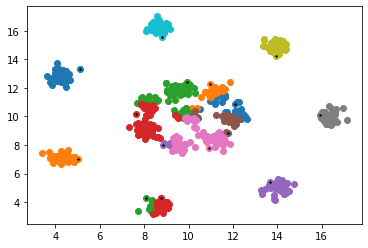
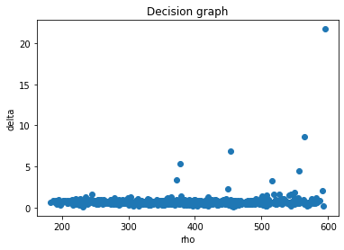
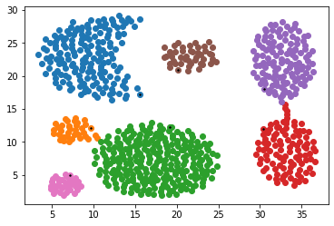
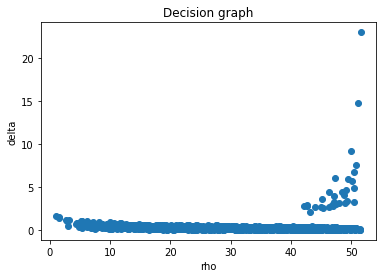
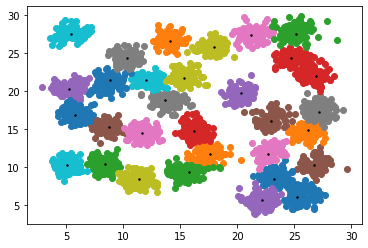
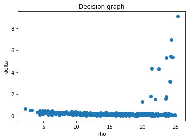
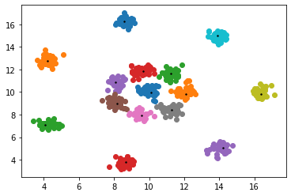

## **Report**
---
### **Clustering**
PB20051035贺维易

本次聚类实验主要实现的是《Clustering by fast search and find of density peaks》中的算法。

### **1.算法思想**
---
集成了k-means和DBSCAN两种算法的思想。

The algorithm has its basis in the assumptions that cluster centers are surrounded by neighbors with lower local density and that they are at a relatively large distance from any points with a higher local density.
- 聚类中心周围密度较低，中心密度较高
- 聚类中心与其它密度更高的点之间通常都距离较远
  
**davies_bouldin_score(DBI)** 可作为内部指标对聚类性能进行度量：

考虑聚类结果的簇划分$C_1,C_2,...,C_k$，簇内样本平均距离
$$
avg(C)=\frac{1}{\mid C\mid} \sum_{i=1}^{\mid C\mid}dist(\pmb{\mu},\pmb{x_i})
$$

簇中心点的距离:
$$
d_{cen}(C_i,C_j)=dist(\pmb{\mu_i},\pmb{\mu_j})
$$

则:
$$
DBI=\frac{1}{k} \sum_{i=1}^{k} \max \limits_{j\neq i}(\frac{(avg(C_i)+avg(C_j))}{d_{cen}(C_i,C_j)})
$$
DBI越小则聚类效果越好。

### **2.算法流程**
---
1. Hyperparameter: a distance threshold $d_c$
2. For each data point $i$, compute two quantities:
   - Local density: $\rho_i=\sum_j{\chi(d_{ij}-d_{c})}$, where $\chi(x)=1$ if $x$<0 and $\chi(x)=0$ otherwize
   - Distance from points of higher density: $\delta_i=\min \limits_{j:\rho_j>\rho_i}d_{ij}$
   - For the point with highest density, take $\delta_i=\max \limits_{j}dij$
3. Identify the cluster centers and OOD points
   - Cluster centers: with both high $\rho_i$ and low $\delta_i$
   - OOD points: with high $\delta_i$ but low $\rho_i$
   - Draw a decision graph, and make decisons.
  我们将会调整阈值的设定来定义聚类中心。
1. Clustering: After the cluster centers have been found, each
remaining point is assigned to the same cluster
as its nearest neighbor of higher density.

### **3.代码实现及解释**
---
- #### **3.1 Load the datasets**
```python
import numpy as np
import pandas as pd
from matplotlib import pyplot as plt
from sklearn.metrics import davies_bouldin_score

Aggregation = pd.read_table("Aggregation.txt",sep = ' ',header=None)
D31 = pd.read_table("D31.txt",sep = ' ',header=None)
R15 = pd.read_table("R15.txt",sep = ' ',header=None)
```
为方便可视化，本次实验采取3个2D数据集：
- Aggregation
- D31
- R15

允许对不同数据集设置不同的超参数。

- #### **3.2 Class DPC**

**3.2.1 Class DPC**
```python
class DPC(object):
    def __init__(self,dc,kernel = 'sign'):
        """
        dc: hyperparameter threshold
        Specially for 2 dimensional dataset
        kernel: choose sign of gauss
        """
        self.dc = dc
        self.dij = None # 距离矩阵（欧式距离）
        self.rho = None # density
        self.delta = None
        self.rho_threshold = None # rho的阈值
        self.delta_threshold = None # delta的阈值
        self.kernel = kernel # choose the kernel
        self.index = None # 记录索引
        self.cluster_list = None # 记录每个点归属的聚类中心
```
**3.2.2 距离矩阵计算**
```python
def cal_dij(self,X):
   """
   该函数计算样本距离矩阵
   X: 样本
   计算两个样本点之间的欧式距离
   """
   samp_num = X.shape[0]
   self.dij = np.zeros((samp_num,samp_num))
   for i in range(samp_num):
      for j in range(i+1, samp_num):
            self.dij[i,j] = np.linalg.norm(X.iloc[i,:] - X.iloc[j,:])
            self.dij[j,i] = self.dij[i,j] # 对称三角矩阵
```
用简单两重循环计算样本距离矩阵。

**3.2.3 计算$\rho$和$\delta$**
```python
def cal_rho(self,X):
   """
   计算样本的rho
   可以选用阶跃函数和高斯函数两种方法
   """

   n = X.shape[0]
   if self.dij is None:
      self.cal_dij(X)
        
      if self.kernel == 'sign':
         self.rho = np.zeros(n) # store rho
         for i in range(n):
            ans = 0
            for j in range(n):
               if self.dij[i,j] < self.dc:
                  ans += 1
               self.rho[i] = ans

      elif self.kernel == 'gauss':
         self.rho = np.sum(np.exp((-self.dij ** 2) / (self.dc ** 2)),axis=1)

   return self.rho

def cal_delta(self,X):
   """
   计算delta,同时对每个点记录离它近的且密度比它大的数据点
   """
   if self.rho is None:
      self.cal_rho(X)

   self.delta = np.zeros(self.rho.shape[0]) # store delta
   max_rho = np.max(self.rho) # 记录rho的最大值
   self.index = np.zeros(self.rho.shape[0]).astype('int')

   for i,di in enumerate(self.dij):
      if self.rho[i] == max_rho:
         self.delta[i] = np.max(di)
         self.index[i] = i
      else:
         di[self.rho <= self.rho[i]] = float("inf") # 不满足条件设为inf
         self.delta[i] = np.min(di)
         self.index[i] = np.argmin(di) # 记录索引

   return self.delta, self.index
```

在$\delta$的计算过程中，为了便于最后进行聚类，设置index列表对每个点记录离它近的且密度比它大的数据点。

**3.2.4 Decision Graph**
```python
def decision_graph(self,X):
   if self.rho is None:
      self.dpc(X)
   plt.title('Decision graph')
   plt.xlabel('rho')
   plt.ylabel('delta')
   plt.scatter(self.rho, self.delta, marker='o')
   plt.show()
```

**3.2.5 Clustering**
```python
def cal_center(self,i):
   """
   对每个点循环回溯其聚类中心
   """
   parent = self.index[i]
   while(self.cluster_list[parent] == -1): # 还未找到聚类中心
      parent = self.index[parent]
   self.cluster_list[i] = self.cluster_list[parent]

def cluster(self,X,rh,delt):
   """
   对剩余点聚类, 设定超参数rh和delt分别对应rho_threshold和
   delta_threshold, 超过这两个值定义为聚类中心
   """
   if self.delta is None:
      self.dpc(X)

   self.delta_threshold = delt
   self.rho_threshold = rh

   self.cluster_list = (-1) * np.ones(X.shape[0]).astype('int')
   # 确定聚类中心
   centers = np.where(np.logical_and(self.rho > rh,self.delta > delt))[0]
   center_num = centers.shape[0] # 聚类中心个数
   # print(centers)

   for i,cen in enumerate(centers):
      self.cluster_list[cen] = i
      self.index[cen] = cen

   # 对剩余点进行聚类
   for i in range(X.shape[0]):
      self.cal_center(i)

   # 对每个类画图
   for i in range(center_num):
      aim = X.iloc[self.cluster_list == i]
      plt.scatter(aim.iloc[:,0],aim.iloc[:,1])
      plt.scatter(X.iloc[centers[i],0],X.iloc[centers[i],1],c=colors[-2],s=2)
   plt.show()
return self.cluster_list
```

- #### **3.3 DBI Evaluation**
仅以数据集Aggregation为例展示评价指标DBI.
```python
model1 = DPC(16)
model1.decision_graph(Aggregation)
cluster_list1 = model1.cluster(Aggregation,0,3)
evaluate1 = davies_bouldin_score(Aggregation,cluster_list1)
print("DBI is: {:.4f}".format(evaluate1))
```
### **4.实验分析**
---
原论文指出：For datasets composed by a small number of points, $\rho_i$ might be affected by large statistical errors. In these cases, it might be useful to estimate the density by more accurate measures.
以R15数据集为例，如果仍采用阶跃函数作为核，很难达到很好的聚类效果（如下图）：
  

此时DBI值也较高。
因此我们按照论文的说法采用高斯核密度估计$\rho_i=\sum_je^{-\frac{d_{ij}^2}{d_c^2}}$.得到聚类结果：
  
显然这是一个更好的结果。

### **5.实验结果**
---
**5.1 Aggregation**

选取阶跃函数作为核计算密度，设置$d_c=16$，决策图如下：
  
从决策图可以看出不存在OOD点，我们可以选择$\rho=0,\delta=3$作为聚类中心的阈值，聚类结果如下图：
  
聚类效果较好，$DBI=0.5071$

**5.2 D31** 

选择高斯函数作为核计算密度，设置$d_c=1$，决策图如下：
  
从决策图可以看出不存在OOD点，选择$\rho=0,\delta=2$作为聚类中心的阈值，聚类结果如下图：
  
聚类效果基本较好，$DBI=0.5510$


**5.3 R15**
选择高斯函数作为核计算密度，设置$d_c=0.5$，决策图如下：
  

从决策图可以看出不存在OOD点，选择$\rho=0,\delta=0.7$作为聚类中心的阈值，聚类结果如下图：
  


聚类效果基本较好，$DBI=0.3148$

### **6.实验总结**
- 在计算$\rho$和$\delta$时使用欧式距离是可行的，这是由于原论文指出这里的方法具有鲁棒性: The method is robust with respect to changes in the metric that do not significantly affect the distances below $d_c$. Clearly, the distance in calculating $\delta$ will be affected by such a change of metric, but it is easy to realize that the structure of the decision graph is a consequence of the ranking of the density values, not of the actual distance between far away points. 
- 在本次实验中，由于数据给出的比较好，从决策图均可看出不存在低$\rho$，高$\delta$的点，即不存在OOD点。
- 参数选取问题
  
  1. 原论文给出阈值$d_c$的一种选取方法：one can choose $d_c$ so that the average number of neighbors is around 1 to 2% of the total number of points in the dataset.
  2. 对于$\rho$和$\delta$的阈值，由于数据集较好，事实上我们只需考虑$\delta$阈值的选取，这可以通过决策图大致看出。进一步地，如果出现人工观察很难区分的情况，可以对$\delta$值的大小进行排序，根据想要聚类的簇数（指定）从大到小读取$\delta$，将其对应的点设置为聚类中心。